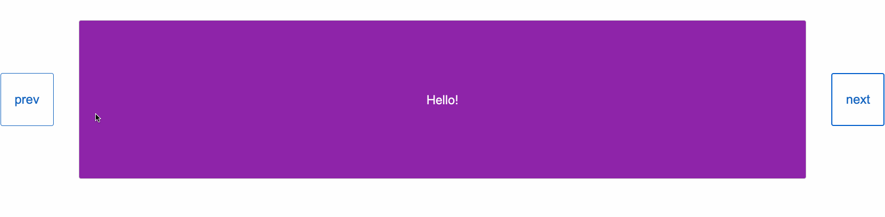

# Carousel Slide Animation Test
Create a sliding animation activated when a user clicks previous or next button.

## References Used
- https://codepen.io/Tifla/pen/xagrvE
- https://developer.mozilla.org/en-US/docs/Web/CSS/CSS_Transitions/Using_CSS_transitions

## Technologies Used
- HTML5
- CSS3
- JavaScript(ES6)

### Final Result

